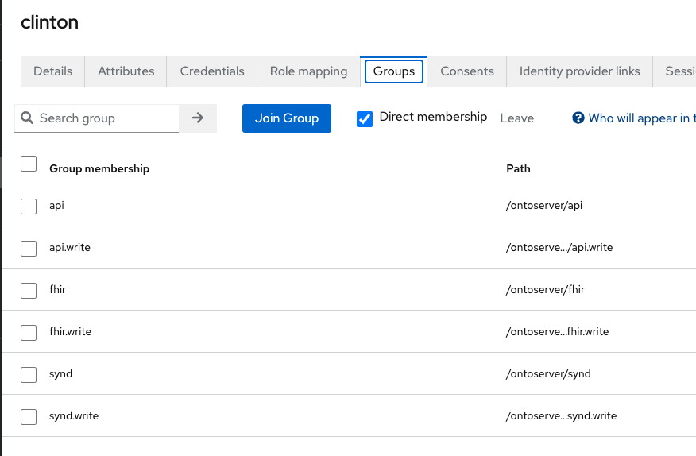
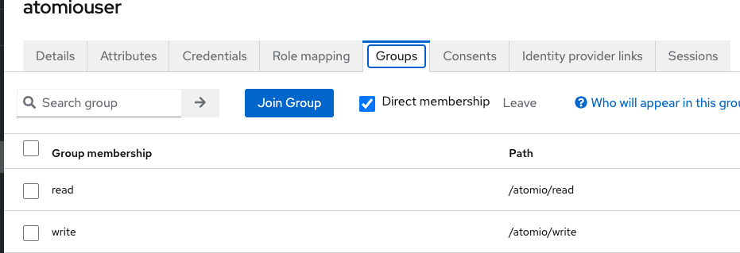

# A basic deployment of Ontoserver4, Atomio and Ontocloak

This project intends to give a basic rundown (not production ready) deployment that can be used to learn how Ontoserver, Atomio and Ontocloak can be configured together, to give you a starting point for your own deployment/experimentation. It is built around images that are hosted at quay.io/repository/aehrc. To get access to these images you will need to:
- Establish an account with quay.io at https://quay.io
- Obtain an appropriate Licence:
- Within Australia, email help@digitalhealth.gov.au to request a (free) Ontoserver licence. ADHA will then arrange authorisation for your quay.io account.
- Elsewhere, email ontoserver-support@csiro.au to discuss licensing terms (both evaluation and production licences are available for single and multiple instances, no limit on number of users). Once the licence is established, CSIRO will register your quay.io account name to enable access to their repository

### Ontocloak

Ontocloak is a wrapper around keycloak, that intends to make it easier to use keycloak with ontoserver.

You can read more about Ontocloak [here](https://ontoserver.csiro.au/site/our-solutions/ontocloak/) and view the technical documentation [here](https://ontoserver.csiro.au/site/technical-documentation/ontocloak-documentation/) and [here](https://ontoserver.csiro.au/docs/6/config-all.html).

A realm file is provided at realms/onto-realm.json that provides some sensibles defaults for a basic ontocloak setup that can be used to secure ontoserver and atomio. A good tutorial that was written from the perspective of someone using keycloak for the first time can be found [here](https://github.com/itcr-uni-luebeck/ontoserver-keycloak) although it is a little out of date, it is a great place to start.


### Ontoserver

You can read more about Ontoserver [here](https://ontoserver.csiro.au/site/our-solutions/ontoserver/) and view the technical documentation [here](https://ontoserver.csiro.au/docs/6/).

### Atomio

You can read more about Atomio [here](https://ontoserver.csiro.au/site/our-solutions/ontoserver/) and view the technical documentation [here](https://ontoserver.csiro.au/docs/6/).

### Putting it all together

Most of the setup is handled within the docker-compose file, with some steps needing to be done manually for the first time. Namely creating the self signed certificates which is mentioned [here](#ontocloak) and generating some keycloak user's that is mentioned [here]()

##### Ontocloak & it's postgres setup

To run Ontocloak, you will need to create some self signed certificates you can do this using openssl from the root of the project. The reason that ontocloak is ran over https is that atomio will not accept a security provider over http.

```
openssl genrsa -out ./certs/ontocloak/server.key 2048
openssl req -new -out ./certs/ontocloak/server.csr -key ./certs/ontocloak/server.key
openssl x509 -req -days 365 -in ./certs/ontocloak/server.csr -signkey ./certs/ontocloak/server.key -out ./certs/ontocloak/server.crt
## Create a truststore that will be mounted into the atomio container
keytool -import -alias ontocloak_crt -file ./certs/ontocloak/server.crt -noprompt -storepass changeit -keystore ./certs/ontocloak/truststore
```

```
ontocloakdemo:
    platform: linux/x86_64
    image: quay.io/aehrc/ontocloak:4
    command:
      - start
      - --import-realm
      # --optimized is needing for keycloak to function properly
      - --optimized
    environment:
      KC_DB: postgres
      KC_DB_URL_HOST: postgres_ontocloak_demo
      KC_DB_URL_DATABASE: keycloak
      KC_DB_PASSWORD: password
      KC_DB_USERNAME: keycloak
      KC_SCHEMA: public
      KEYCLOAK_ADMIN: admin
      KEYCLOAK_ADMIN_PASSWORD: admin
      KC_HOSTNAME_STRICT: 'false'
      KC_HTTPS_CERTIFICATE_FILE: /etc/x509/https/tls.crt
      KC_HTTPS_CERTIFICATE_KEY_FILE: /etc/x509/https/tls.key
      KEYCLOAK_FRONTEND_URL: https://localhost:8443/auth
      JAVA_OPTS_APPEND: -Dontocloak.action.agreement.enduser.version=1.0 -Dontocloak.action.agreement.enduser.title='Acme End User Agreement v1.0' -Dontocloak.action.agreement.enduser.html_text='Some end user agreement text' -Dontocloak.action.agreement.customer.version=1.0 -Dontocloak.action.agreement.customer.title='Acme Customer Agreement v1.0' -Dontocloak.action.agreement.customer.html_text='Some customer agreement text'
    ports: 
      - "8443:8443"
    volumes: 
        - ./certs/ontocloak/server.crt:/etc/x509/https/tls.crt
        - ./certs/ontocloak/server.key:/etc/x509/https/tls.key
        - ./realms/onto-realm.json:/opt/keycloak/data/import/onto-realm.json:ro

    depends_on:
      postgres_ontocloak_demo:
        condition: service_healthy
    networks:
      - ontocloak_demo_dev_network
  
  postgres_ontocloak_demo:
    image: postgres:14.2
    command: postgres -c 'max_connections=200'
    volumes: 
      - pgdata_ontocloak_demo:/var/lib/postgresql/data
    environment:
      POSTGRES_DB: keycloak
      POSTGRES_USER: keycloak
      POSTGRES_PASSWORD: password
    healthcheck:
      test: "exit 0"
    ports:
      - "5436:5432"
    networks:
      - ontocloak_demo_dev_network
```

Some important things to note in this part of the docker-compose is the KC_PASSWORD,_USERNAME,_DB and POSTGRES_PASSWORD,_USERNAME,_DB match.
KEYCLOAK_ADMIN and KEYCLOAK_ADMIN_PASSWORD are the passwords for the administrator account that will be created automatically on first start for ontocloak.

You will need to sign into ontocloak and create 2 users, add one of the users to the atomio groups (SYND_READ, SYND_WRITE) and the other to the ontoserver groups (system/*.write). All user's by default have ontoserver read rights.

The two example user's are below. Make sure you are in the ontoserver realm and not the master realm.






##### Atomio setup

The only thing really of note here, that is outside the normal setup is the JAVA_TOOL_OPTIONS. This needs to be passed to allow atomio to trust self signed certificates. The Dockerfile located at /atomio/Dockerfile takes the certificate that is located at /certs/ontocloak/server.crt and creates a truststore in the atomio container.

```
atomio:
    platform: linux/amd64
    build: atomio
    container_name: atomio
    environment:
      # The 'aud' in the token generated by keycloak for this client
      - atomio.security.audience=atomio
      - atomio.security.hsts=true
      # Whether this server is to be secured by tokens
      - atomio.security.enabled=true
      - atomio.security.anonymousFeedRead=true
      - atomio.cors.allowedOriginPatterns=ALL
      # The location of the issuer of tokens
      - atomio.security.issuer-uri=https://ontocloakdemo:8443/auth/realms/ontoserver
      - JAVA_TOOL_OPTIONS=-Djavax.net.ssl.trustStore=/usr/lib/jvm/java-17-openjdk/lib/security/truststore -Djavax.net.ssl.trustStorePassword=changeit
    depends_on:
      - ontocloakdemo
    ports:
      - "5000:8080"
    networks:
      - ontocloak_demo_dev_network
    restart: always
```

##### Ontoserver setup 

Ontoserver can't (currently) discover it's security settings in the same manner as Atomio, so instead you need to copy the rs256 public key from the ontoserver realm in keycloak.
Similarly you need to get the client secret for the atomio client within the ontoserver realm of keycloak.

Alot of the environment values are commented, so those values will not be expanded upon here. You can find a full lost of config values for ontoserver [here](https://ontoserver.csiro.au/docs/6/config-all.html).
```
ontoserver:
    image: quay.io/aehrc/ontoserver:ctsa-6
    container_name: ontoserver-stack
    depends_on:
      - ontocloakdemo
      - postgres_ontocloak_demo
      - db
    environment:
      # A list of all environment configs is available here: https://ontoserver.csiro.au/docs/6/config-all.html
      - ONTOSERVER_INSECURE=true
      - ontoserver.fhir.base=https://localhost:8000/fhir
      - ontoserver.fhir.header.cacheControl=must-revalidate,max-age=1
      # enables role based security in ontoserver
      # - ontoserver.security.enabled=true
      # readonly settings for each endpoint, by default this is set to false
      - ontoserver.security.readOnly.api=false
      - ontoserver.security.readOnly.fhir=false
      - ontoserver.security.readOnly.synd=false
      # This needs to be the public key for your realm, go to https://ontocloakdemo:8443/auth/admin/master/console/#/{{realmName}}/realm-settings/keys and copy the public key from rs256
      - ontoserver.security.token.secret=-----BEGIN PUBLIC KEY-----MIIBIjANBgkqhkiG9w0BAQEFAAOCAQ8AMIIBCgKCAQEAnYW8O6vM1Yb0hL41AVIAq63IcEmF57LzFaWKZabLLrqjcZxjQTwnCLKPe2+PE7Gynb10F35efIv+SSIWLc6G9O1Fex3zqchXLAq+V7l5EIaK8rXl9Y0qrDonddAhHdDe8TS4i/DUki3VoGfhbwa3HnZGmAre1VnsYfEIrLuv9A5eOYI56cq13U6ev9rrLhVvX7yQ8WjzMi1z1W8C4OcrCxZLMIWxiDBoFtefVk4qY4uYkcTDEmzKmNkb0cFF/2f1JrsWObC3mM5pJcgN7t+57Ag9EyMEwBYk8VQT5u7vJuYx99KceZWtNYzcfrvYPR8iUZMj0YULOXUItNFlBDSYzQIDAQAB-----END PUBLIC KEY-----
      - conformance.security.description=This is a description that you can use to describe how oauth works with this server
      # this is featured in the machine-readable ConformanceStatement and should point to the "authorize" url of your keycloak installation
      - conformance.security.authorize=https://ontocloakdemo:8443/auth/realms/ontoserver/protocol/openid-connect/auth 
      # The token endpoint
      - conformance.security.token=https://ontocloakdemo:8443/auth/realms/ontoserver/protocol/openid-connect/token 
      - JAVA_OPTS=-Xmx8G
      - ontoserver.security.verify.certs=false
      # The location of the upstream syndication server
      - atom.syndication.feedLocation=http://atomio:8080/feed/test/syndication.xml
      # Hostname (including protocol, e.g. http:// or https://) for which to provide OAuth2 credentials when requesting content
      - authentication.oauth.endpoint.0=http://atomio:8080
      # OAuth client ID to send when requesting a system token for use in requesting content from authentication.oauth.endpoint.{n}
      - authentication.oauth.endpoint.client_id.0=atomio
      # Client secret to send when requesting an OAuth2 system token for use in requesting content from authentication.oauth.endpoint.{n}
      - authentication.oauth.endpoint.client_secret.0=goztCc8ZqJOgMmxlvEk3UWNMEvIcuhSB
      #  Strategy (basic_auth or body) to use when requesting an OAuth2 system token for use in requesting content authentication.oauth.endpoint.{n}
      - authentication.oauth.endpoint.strategy.0=basic_auth
      # Token endpoint URL for requesting an OAuth token for use in retrieving content from authentication.oauth.endpoint.{n}
      - authentication.oauth.endpoint.token_endpoint.0=https://ontocloakdemo:8443/auth/realms/ontoserver/protocol/openid-connect/token
      - TZ=Australia/Brisbane
    volumes:
      - onto-data:/var/onto
    logging:
      options:
        max-size: 1024m
    networks:
      - ontocloak_demo_dev_network
```

### Postman

In the postman folder you will find some environments, and example requests to do the things that you will need client tokens obtained from keycloak. There is two environments - one for ontoserver, and one for atomio.


You may need to replace some of these environment variables with the ones from your setup.


Each of the folder's themselves have tokens set on them, and to request a token for said folder change your environment to either ontoserver/atomio and make the request to keycloak.

This is an example of the structure of a request for a token here:


A few things that you will have to do:

- Create a new feed in atomio through {{atomio}}/feed
- Create an entry in the feed you just created through {{atomio}}/feed/{{feedName}}
